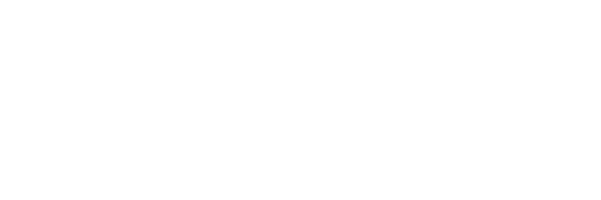
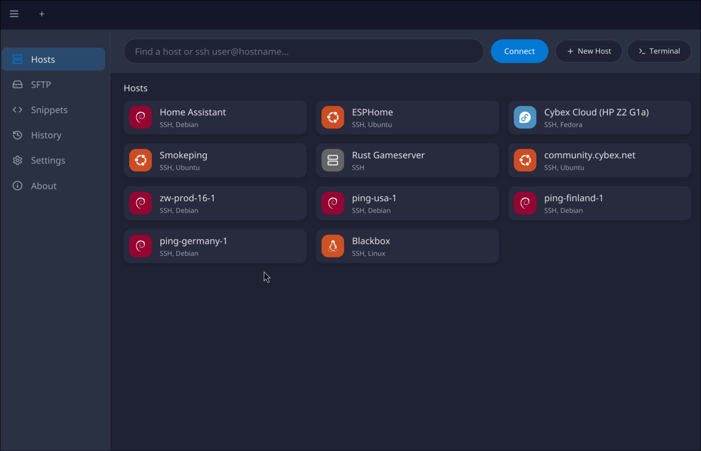
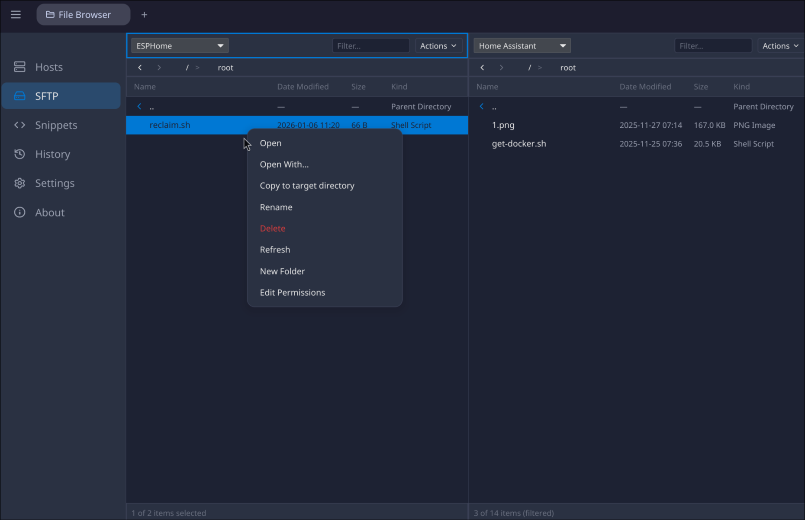

<div align="center">



# Portal

**A modern, fast SSH client for macOS and Linux**

[](LICENSE)
[]()
[](https://www.rust-lang.org/)



</div>

---

Portal is a native SSH client built for speed and simplicity. Manage your servers with an intuitive interface that's equally comfortable with keyboard shortcuts or mouse navigation. Built with Rust for native performance, with full Wayland support on Linux.

## Highlights

<table>
<tr>
<td width="33%" valign="top">

### Multi-Tab Terminal
Manage multiple SSH sessions in tabs. Switch between servers instantly without juggling windows.

</td>
<td width="33%" valign="top">

### Dual-Pane SFTP
Browse local and remote files side by side. Drag, drop, copy, and manage files with ease.

</td>
<td width="33%" valign="top">

### Smart OS Detection
Automatically detects 20+ operating systems and displays branded icons for Ubuntu, Debian, Arch, Fedora, and more.

</td>
</tr>
<tr>
<td width="33%" valign="top">

### Built-in File Viewer
View code with syntax highlighting, preview images and PDFs, edit markdown—all without leaving Portal.

</td>
<td width="33%" valign="top">

### Beautiful Themes
Choose from 5 built-in themes including the popular Catppuccin palette in both light and dark variants.

</td>
<td width="33%" valign="top">

### Command Snippets
Save frequently used commands and insert them into any session with a click. Never retype complex commands.

</td>
</tr>
</table>

## Features

### Terminal

- **Multi-tab sessions** — Open multiple SSH connections in tabs
- **Local terminal** — Launch local shell sessions alongside remote connections
- **Adjustable font size** — Scale from 6px to 20px for your preference
- **SSH key installation** — Install your public key on remote servers with `Ctrl+Shift+K`
- **Status bar** — See hostname and connection duration at a glance
- **Session history** — Quick reconnect to recent servers

### SFTP File Browser

- **Dual-pane interface** — Local filesystem on one side, remote on the other
- **File operations** — Copy, rename, delete, and change permissions
- **Hidden files toggle** — Show or hide dotfiles with one click
- **Quick filter** — Search files in the current directory
- **Breadcrumb navigation** — Click any part of the path to jump there
- **Context menus** — Right-click for common actions

### Host Management

- **Host groups** — Organize servers into folders
- **Quick connect** — Type `user@hostname` to connect instantly
- **Search & filter** — Find hosts as you type
- **Connection history** — See when you last connected and for how long
- **OS detection** — Automatic identification with branded icons for:
  - Ubuntu, Debian, Fedora, Arch, CentOS, RHEL
  - openSUSE, NixOS, Manjaro, Linux Mint, Pop!_OS
  - Gentoo, Alpine, Kali, Rocky, AlmaLinux
  - macOS, FreeBSD, OpenBSD, NetBSD, Windows

### File Viewer

- **Syntax highlighting** — Support for 20+ languages including Rust, Python, JavaScript, Go, and more
- **Image viewer** — View PNG, JPG, GIF, WebP, SVG with zoom controls
- **PDF viewer** — Read PDF documents with page navigation
- **Markdown preview** — Toggle between edit and rendered preview
- **In-app editing** — Make quick edits without leaving Portal

### Customization

- **5 built-in themes**
  - Portal Default
  - Catppuccin Latte (light)
  - Catppuccin Frappé (dark)
  - Catppuccin Macchiato (dark)
  - Catppuccin Mocha (dark)
- **Responsive layout** — Sidebar auto-collapses on narrow windows
- **Keyboard-first** — Full keyboard navigation support



## Installation

### Download

<!--
Download the latest release for your platform:

| Platform | Download |
|----------|----------|
| macOS (Intel) | [portal-macos-x64.dmg]() |
| macOS (Apple Silicon) | [portal-macos-arm64.dmg]() |
| Linux (AppImage) | [portal-linux-x64.AppImage]() |
| Linux (deb) | [portal-linux-x64.deb]() |
| Linux (rpm) | [portal-linux-x64.rpm]() |

**Linux users:** Portal fully supports Wayland. No X11 compatibility layer needed.
-->

*Binary releases coming soon. For now, build from source.*

### Build from Source

Requires Rust 1.85 or later.

```bash
git clone https://github.com/USER/portal.git
cd portal
./run.sh build
./run.sh run
```

**Build commands:**

```bash
./run.sh build   # Build release binary
./run.sh run     # Build and run release
./run.sh dev     # Build and run debug
./run.sh check   # Run cargo check and clippy
```

## Quick Start

1. **Launch Portal** — Run the application
2. **Add a host** — Click the `+` button and enter your server details
3. **Connect** — Double-click a host card or press Enter to connect

That's it. You're in.

## Keyboard Shortcuts

| Shortcut | Action |
|----------|--------|
| `Ctrl+Shift+K` | Install SSH public key on remote server |
| `Ctrl+Tab` | Switch to next tab |
| `Ctrl+Shift+Tab` | Switch to previous tab |
| `Ctrl+W` | Close current tab |

## Built With

- [Rust](https://www.rust-lang.org/) — Systems programming language
- [Iced](https://iced.rs/) — Cross-platform GUI framework
- [alacritty_terminal](https://github.com/alacritty/alacritty) — Terminal emulation
- [russh](https://github.com/warp-tech/russh) — SSH protocol implementation

## Configuration

Portal stores configuration in your platform's config directory:

- **Linux:** `~/.config/portal/`
- **macOS:** `~/Library/Application Support/portal/`

Configuration files:
- `hosts.toml` — Saved host definitions
- `snippets.toml` — Command snippets
- `settings.toml` — Theme and font preferences
- `history.toml` — Connection history
- `known_hosts` — SSH host key storage

## License

MIT License. See [LICENSE](LICENSE) for details.

---

<div align="center">

**[Report Bug](../../issues)** · **[Request Feature](../../issues)**

</div>
