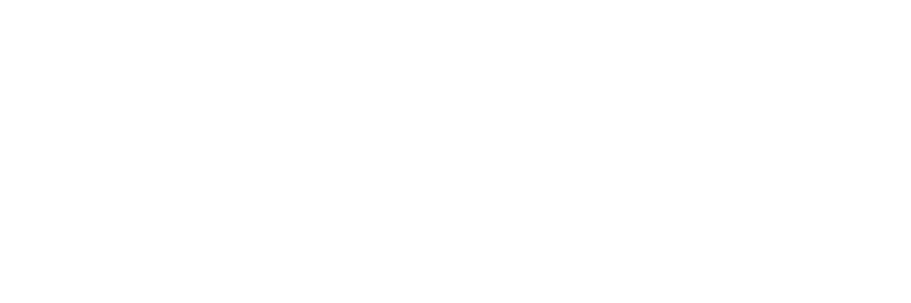
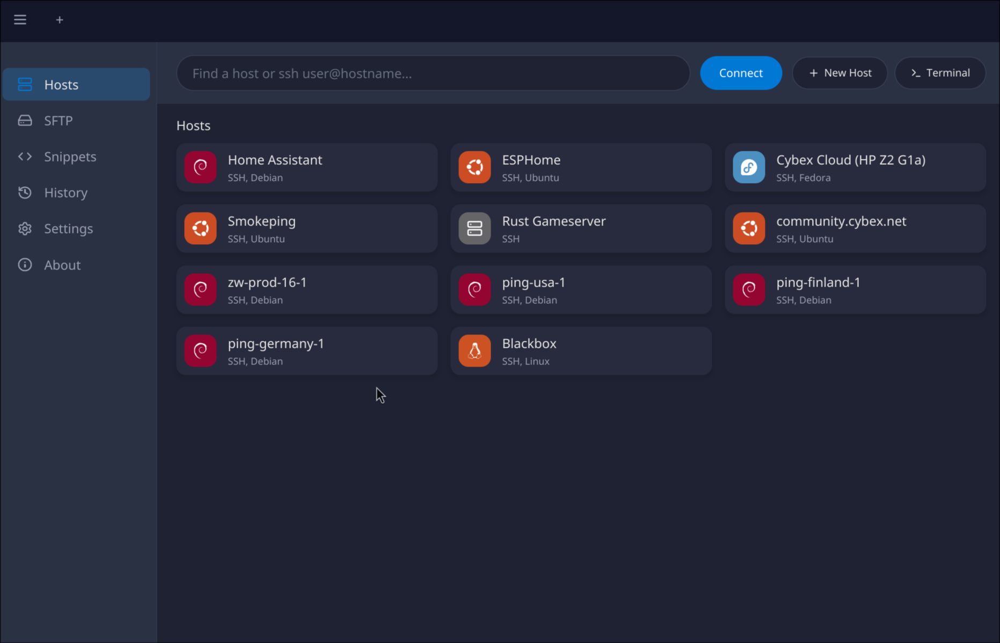
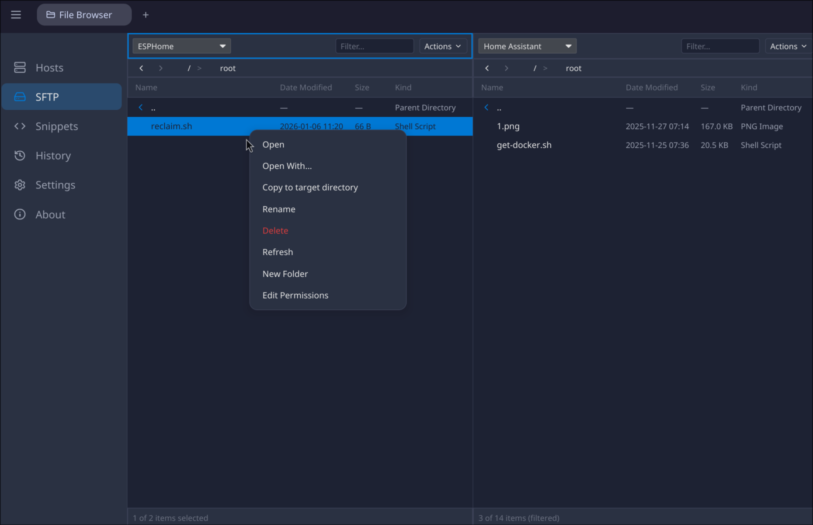

<div align="center">



# Portal

**A modern, fast SSH and VNC client for Linux**

[](LICENSE)
[](https://www.rust-lang.org/)
[](https://github.com/DigitalPals/portal/releases)
[](https://github.com/DigitalPals/portal/releases)
[](https://github.com/DigitalPals/portal/releases)
[](https://github.com/DigitalPals/portal/releases)



</div>

---

Portal is a native SSH and VNC client built for speed and simplicity. Manage your servers with an intuitive interface that's equally comfortable with keyboard shortcuts or mouse navigation. Built with Rust for native performance, with full Wayland support on Linux.

## Highlights

**`>_` Multi-Tab Terminal** — Manage multiple SSH sessions in tabs. Switch between servers instantly without juggling windows.

**`<>` Portal Hub Beta** — Keep SSH terminal sessions alive through a Tailscale-only hub, sync hosts/settings/snippets, and store encrypted private-key vault items.

**`< >` Dual-Pane SFTP** — Browse local and remote files side by side. Drag, drop, copy, and manage files with ease.

**`{ }` Smart OS Detection** — Automatically detects 20+ operating systems and displays branded icons for Ubuntu, Debian, Arch, Fedora, and more.

**`#!` Built-in File Viewer** — View code with syntax highlighting, preview images and PDFs, edit markdown—all without leaving Portal.

**`::` Beautiful Themes** — Choose from 5 built-in themes including the popular Catppuccin palette in both light and dark variants.

**`/>` Command Snippets** — Save frequently used commands and insert them into any session with a click. Never retype complex commands.

**`[]` VNC Remote Desktop** — Connect to VNC servers with GPU-accelerated rendering. Supports multiple encodings, ARD authentication, and multi-monitor displays.

## Features

### Terminal

- **Multi-tab sessions** — Open multiple SSH connections in tabs
- **Local terminal** — Launch local shell sessions alongside remote connections
- **Adjustable font size** — Scale from 6px to 20px for your preference
- **Configurable scroll speed** — Tune mouse wheel and trackpad scrollback speed
- **SSH key installation** — Install your public key on remote servers with `Ctrl+Shift+K`
- **Image clipboard paste** — Paste a screenshot into an SSH terminal to upload it and insert the remote image path
- **Status bar** — See hostname and connection duration at a glance
- **Session history** — Quick reconnect to recent servers
- **Portal Hub beta** — Route selected SSH hosts through Portal Hub for persistent remote terminal sessions, resumable thumbnails, reconnect replay, profile sync, and encrypted key vault storage

### SFTP File Browser

- **Dual-pane interface** — Local filesystem on one side, remote on the other
- **File operations** — Copy, rename, delete, and change permissions
- **Hidden files toggle** — Show or hide dotfiles with one click
- **Quick filter** — Search files in the current directory
- **Breadcrumb navigation** — Click any part of the path to jump there
- **Context menus** — Right-click for common actions

### Host Management

- **Host groups** — Organize servers into folders
- **Quick connect** — Type `user@hostname` to connect instantly
- **Search & filter** — Find hosts as you type
- **Connection history** — See when you last connected and for how long
- **OS detection** — Automatic identification with branded icons for:
  - Ubuntu, Debian, Fedora, Arch, CentOS, RHEL
  - openSUSE, NixOS, Manjaro, Linux Mint, Pop!_OS
  - Gentoo, Alpine, Kali, Rocky, AlmaLinux
  - macOS, FreeBSD, OpenBSD, NetBSD, Windows

### File Viewer

- **Syntax highlighting** — Support for 20+ languages including Rust, Python, JavaScript, Go, and more
- **Image viewer** — View PNG, JPG, GIF, WebP, SVG with zoom controls
- **PDF viewer** — Read PDF documents with page navigation
- **Markdown preview** — Toggle between edit and rendered preview
- **In-app editing** — Make quick edits without leaving Portal

### VNC Remote Desktop

- **GPU-accelerated rendering** — Custom wgpu shader for efficient framebuffer display
- **Multiple encodings** — Tight, ZRLE, CopyRect, and Raw with automatic selection
- **ARD authentication** — Apple Remote Desktop support for macOS Screen Sharing
- **Multi-monitor support** — Discover and select individual displays
- **Scaling modes** — Fit, Actual (1:1), and Stretch modes
- **Keyboard passthrough** — Forward all keystrokes to the remote desktop
- **Special key toolbar** — Send Ctrl+Alt+Del, Alt+Tab, Super, Print Screen, and more
- **Clipboard sharing** — Bidirectional clipboard between local and remote
- **Screenshot capture** — Save the current VNC view to a file
- **Adaptive quality** — FPS tracking with configurable refresh rate, encoding, and color depth

### Customization

- **5 built-in themes**
  - Portal Default
  - Catppuccin Latte (light)
  - Catppuccin Frappé (dark)
  - Catppuccin Macchiato (dark)
  - Catppuccin Mocha (dark)
- **Responsive layout** — Sidebar auto-collapses on narrow windows
- **Keyboard-first** — Full keyboard navigation support



## Installation

### Download

Download from the Releases page:
https://github.com/DigitalPals/portal/releases

Pick the file that matches your OS and CPU:

| Platform | Asset name |
|----------|------------|
| Linux (arm64) | `portal-*-linux-arm64.deb` / `.rpm` / `.tar.gz` |
| Linux (x86_64) | `portal-*-linux-x86_64.AppImage` / `.deb` / `.rpm` / `.tar.gz` |

Verify downloaded release assets with:

```bash
sha256sum --ignore-missing -c SHA256SUMS
```

### Install on Linux

Pick one of these options:

**AppImage (x86_64):**
```bash
chmod +x portal-*-linux-x86_64.AppImage
./portal-*-linux-x86_64.AppImage
```

**DEB (Debian/Ubuntu):**
```bash
sudo dpkg -i portal-*-linux-*.deb
```

**RPM (Fedora/RHEL):**
```bash
sudo rpm -i portal-*-linux-*.rpm
```

**Tarball (manual):**
```bash
tar -xzf portal-*-linux-*.tar.gz
sudo mv portal /usr/local/bin/
portal
```

Portal is built for Wayland. If it does not start, install your distro's Wayland/XKB/Vulkan runtime packages and try again.

### Build from Source

Requires Rust 1.88 or later.

```bash
git clone https://github.com/DigitalPals/portal.git
cd portal
./run.sh build
./run.sh run
```

**Build commands:**

```bash
./run.sh build   # Build release binary
./run.sh run     # Build and run release
./run.sh dev     # Build and run debug
./run.sh check   # Run cargo check and clippy
```

**Remote build on The Beast:**

```bash
./run.sh remote-build    # Sync source and run cargo build remotely
./run.sh remote-release  # Sync source and run cargo build --release remotely
./run.sh remote-check    # Sync source and run check/clippy remotely
./run.sh remote-test     # Sync source and run cargo test remotely
```

The remote workflow mirrors tracked files plus non-ignored untracked files to
`root@10.10.0.233:/root/Code/portal` by default and preserves the remote
`target/` directory between runs. Override the destination with
`PORTAL_REMOTE_HOST` and `PORTAL_REMOTE_DIR`, or call
`scripts/remote-build.sh --help` for command-level options. `remote-build` and
`remote-release` copy the resulting binary back to `target/debug/portal` or
`target/release/portal`; pass `--no-fetch` to the script for remote-only builds.
Remote builds unset `RUSTC_WRAPPER` and `SCCACHE_*`, and override Cargo's
`rustc-wrapper`, by default so Cargo runs directly on the remote host; set
`PORTAL_REMOTE_USE_SCCACHE=1` to opt back into remote-side sccache.

## Operations

Portal logs to the console and to a daily rotating file in the config logs
directory. The default log level is INFO in debug builds and WARN in release
builds. Override it with `RUST_LOG`.

Environment variables:

- `PORTAL_LOG_DIR` (optional) - set a custom log directory. Set to an empty
  string to disable file logging.
- `PORTAL_MAX_COMMAND_OUTPUT_BYTES` (optional) - cap command output collected
  from SSH exec calls. Default: 4194304 (4 MiB).
- `PORTAL_VNC_ENCODING` (optional) - VNC encoding preference: `auto`, `tight`, `zrle`, or `raw`. Default: `auto`.
- `PORTAL_VNC_COLOR_DEPTH` (optional) - color depth in bits: `16` or `32`. Default: `32`.
- `PORTAL_VNC_REFRESH_FPS` (optional) - framebuffer refresh request rate, 1-20. Default: `10`.
- `PORTAL_VNC_POINTER_INTERVAL_MS` (optional) - minimum interval between pointer events in ms. Default: `16`.
- `PORTAL_VNC_REMOTE_RESIZE` (optional) - request remote desktop resize. Default: `false`.
- `PORTAL_VNC_QUALITY` (optional) - quality preset for new VNC sessions: `auto`, `speed`, `balanced`, `quality`, or `lossless`. Default: `auto`.
- `PORTAL_VNC_DEBUG` (optional) - enable VNC debug logging.

Example:

```bash
RUST_LOG=portal=info PORTAL_LOG_DIR=/var/log/portal ./portal
```

### NixOS / Nix Flakes

Portal is available as a Nix flake with binaries cached on [Cachix](https://app.cachix.org/cache/digitalpals).

**Run directly:**

```bash
nix run github:DigitalPals/portal/vX.Y.Z
```

**Install in NixOS configuration** (`flake.nix`):

```nix
{
  inputs = {
    nixpkgs.url = "github:NixOS/nixpkgs/nixos-unstable";
    # Use a release tag for stable builds with Cachix cache hits.
    # Don't use inputs.nixpkgs.follows for portal - it breaks cachix
    portal.url = "github:DigitalPals/portal/vX.Y.Z";
  };

  outputs = { nixpkgs, portal, ... }: {
    nixosConfigurations.yourhostname = nixpkgs.lib.nixosSystem {
      system = "x86_64-linux";
      modules = [
        ({ pkgs, ... }: {
          # Enable cachix for pre-built binaries
          nix.settings.substituters = [ "https://digitalpals.cachix.org" ];
          nix.settings.trusted-public-keys = [ "digitalpals.cachix.org-1:YWuWBw08EbEeTsIccpPfRTaqksfo4QtAVQaTRljYFm8=" ];

          environment.systemPackages = [ portal.packages.${pkgs.system}.default ];
        })
      ];
    };
  };
}
```

> **Note:** Do not add `inputs.nixpkgs.follows = "nixpkgs"` to the portal input. This changes the derivation hash and prevents cachix from providing pre-built binaries.

> **Note:** Replace `vX.Y.Z` with a published release tag. The `main` branch may contain unreleased development changes.

**Build from source:**

```bash
nix build
./result/bin/portal
```

## Quick Start

1. **Launch Portal** — Run the application
2. **Add a host** — Click the `+` button and enter your server details
3. **Connect** — Double-click a host card or press Enter to connect

That's it. You're in.

## Portal Hub Beta

Portal can route SSH terminal sessions through [Portal Hub](https://github.com/DigitalPals/portal-hub) so remote shells survive a Portal crash, laptop sleep, or network drop. Portal Hub can also store synced hosts, settings, snippets, and encrypted private-key vault items. The hub is intended to run on a small Linux host or LXC reachable only over Tailscale.

To use it:

1. Deploy Portal Hub and restrict access with Tailscale ACLs.
2. Start the Portal Hub web server and create the first owner account.
3. In Portal settings, enable Portal Hub and set the Hub host, web port (`8080` by default), and Web URL.
4. Use **Sign in** on the Portal Hub settings tab to authenticate through the browser.
5. Choose whether to upload this device's hosts/settings/snippets to Hub or pull Hub's profile to this device.
6. Enable Portal Hub on individual SSH hosts that use SSH Agent or Public Key authentication.
7. Open the Sessions view to see active proxy sessions, terminal thumbnails, and resume an existing session.

Typing `exit` in the remote shell closes the real session. Closing the Portal tab or losing connectivity only detaches Portal from the proxy session.

For SSH hosts that use a local private key, Portal keeps the key on the laptop.
When connecting through Portal Hub it starts a managed local `ssh-agent` when
needed, loads the selected or default key, and forwards that agent to the proxy.

Vault private keys are encrypted locally before sync. Portal Hub stores the
encrypted blobs but does not receive the vault passphrase or decrypted key
material.

## Keyboard Shortcuts

| Shortcut | Action |
|----------|--------|
| `Ctrl+Shift+K` | Install SSH public key on remote server |
| `Ctrl+Tab` | Switch to next tab |
| `Ctrl+Shift+Tab` | Switch to previous tab |
| `Ctrl+W` | Close current tab |
| `F11` | Toggle fullscreen (VNC) |
| `Ctrl+Shift+S` | Capture screenshot (VNC) |
| `Ctrl+Shift+V` | Paste clipboard to VNC server |
| `Ctrl+Shift+Escape` | Release keyboard passthrough (VNC) |

## Built With

- [Rust](https://www.rust-lang.org/) — Systems programming language
- [Iced](https://iced.rs/) — Cross-platform GUI framework
- [Alacritty Terminal](https://github.com/alacritty/alacritty) — Terminal emulation
- [Russh](https://github.com/warp-tech/russh) — SSH protocol implementation
- [vnc-rs](https://github.com/niclas3640/vnc-rs) — VNC client implementation (vendored)

## Configuration

Portal stores configuration in your platform's config directory:

- **Linux:** `~/.config/portal/`
- **macOS:** `~/Library/Application Support/portal/`

Configuration files:
- `hosts.toml` — Saved host definitions (SSH and VNC protocols)
- `snippets.toml` — Command snippets
- `snippet_history.toml` — Snippet execution history (`enabled`, `store_command`, `store_output`, `redact_output`)
- `settings.toml` — Theme, terminal font and scroll preferences, VNC settings, and Portal Hub settings
- `history.toml` — Connection history
- `known_hosts` — SSH host key storage

## License

MIT License. See [LICENSE](LICENSE) for details.

---

<div align="center">

**[Report Bug](../../issues)** · **[Request Feature](../../issues)**

</div>
